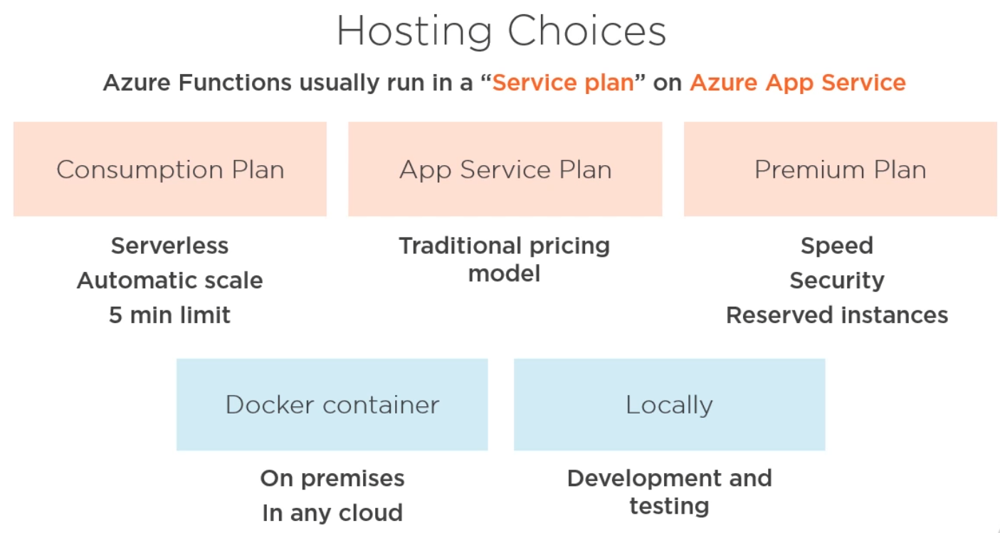
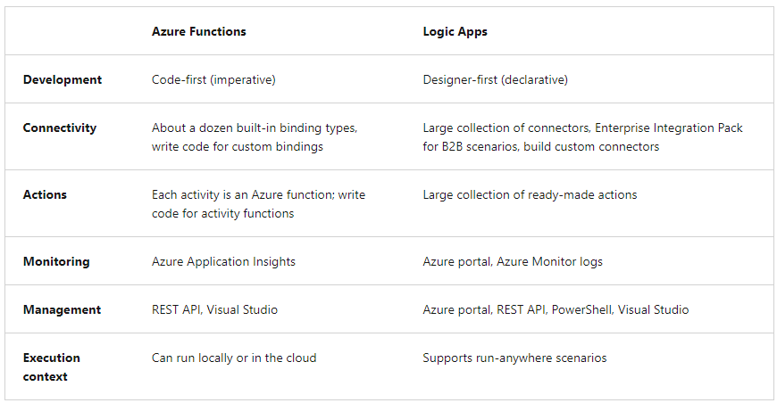
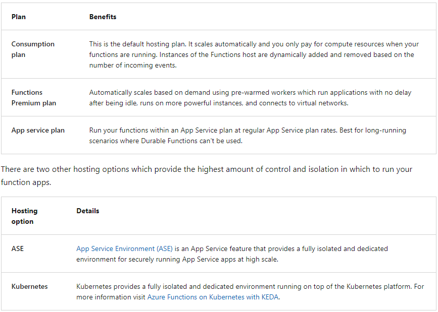
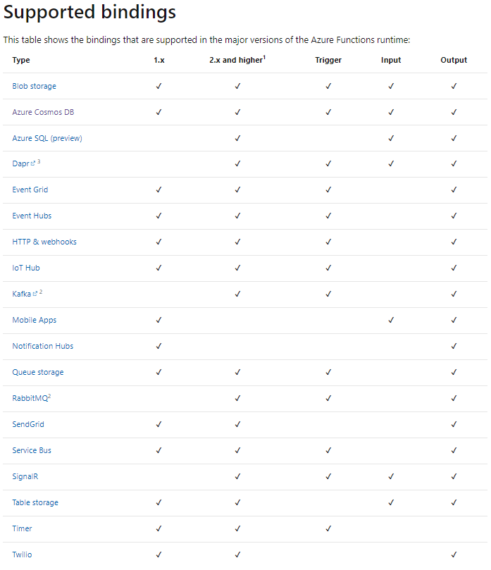
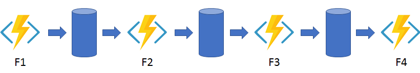
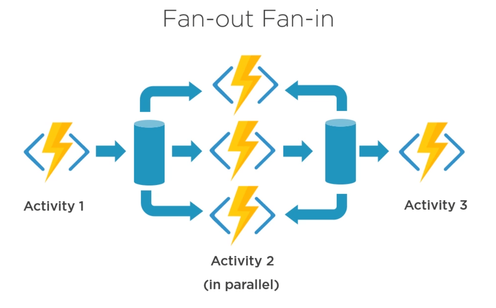
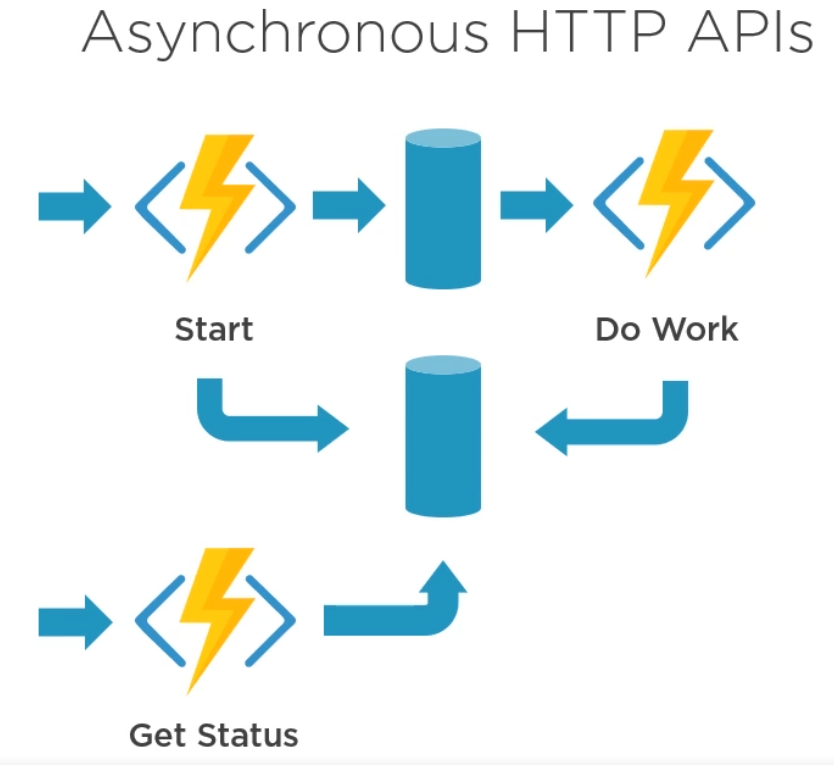
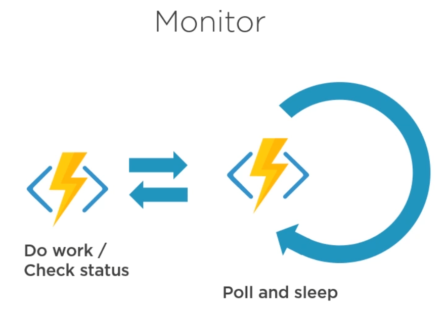
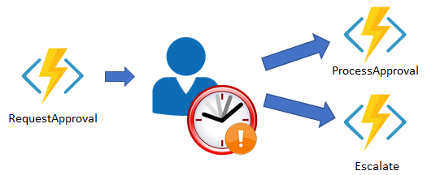

# Azure Functions
- Azure Functions are a great solution for processing data, integrating systems, working with the internet-of-things (IoT), 
  and building simple APIs and microservices.

## Compare Azure Functions and Azure Logic Apps
- Both Functions and Logic Apps enable serverless workloads
- Azure Functions is a serverless compute service, whereas Azure Logic Apps provides serverless workflows
- For Azure Functions, you develop orchestrations by writing code and using the Durable Functions extension 
- For Logic Apps, you create orchestrations by using a GUI or editing configuration files (think Camunda)

## Compare Functions and WebJobs
- WebJobs can be created in an AppService, separate from a normal deployment (one from Github/Dockerhub)
- Like Azure Functions, Azure App Service WebJobs with the WebJobs SDK is a code-first integration service that is designed for developers
- Azure Functions is built on the WebJobs SDK, so it shares many of the same event triggers and connections to other Azure services
- WebJobs not available for Linux plan

## Azure Functions hosting options

- Options:
  - Consumption plan
  - Functions Premium plan
  - App service plan
- If you run on an App Service plan, you should enable the Always on setting so that your function app runs correctly. 
- On an App Service plan, the functions runtime goes idle after a few minutes of inactivity, so only HTTP triggers will "wake up" 
  your functions. 
- Always on is available only on an App Service plan. On a Consumption plan, the platform activates function apps automatically.

## Storage account requirements
- On any plan, a function app requires a general Azure Storage account, which supports Azure Blob, Queue, Files, and Table storage.
  This is because Functions relies on Azure Storage for operations such as managing triggers and logging function executions, 
  but some storage accounts do not support queues and tables

## Scale Azure Functions
- Azure Functions uses a component called the scale controller to monitor the rate of events and determine whether to scale out or scale in
- The unit of scale for Azure Functions is the function app
- The number of instances is eventually "scaled in" to zero when no functions are running within a function app
- Scaling behaviors
  - **Maximum instances**: A single function app only scales out to a maximum of 200 instances
  - **New instance rate**: For HTTP triggers, new instances are allocated, at most, once per second. For non-HTTP triggers, new instances are allocated, at most, once every 30 second

## Implementation
- implemented using the **Function App**
- very similar to how App Service is deployed
- can use deployment slots
- supports multiple trigger types (TimerTrigger, HttpTrigger, BlobTrigger, CosmosDBTrigger, QueueTrigger, EventGridTrigger etc...)
- multiple triggers ca be defined in the same Java class
- supports creation and modification of functions, directly in the Azure portal (probably just for interpreted languages)
- when creating a blob triggered function, we need to specify the storage name and the blob container to watch (that belongs to that storage and that holds the blobs)
- similarly, when creating a queue triggered function, we need to specify the storage name and the queue to watch

## Bindings
- Binding to a function is a way of declarative connecting another resource to the function
- Some bindings support a special direction **`inout`**. If you use inout, only the Advanced editor is available via the "Integrate" tab in the portal
- input and output bindings are permitted -> see BindingExamples.java
- in the BindingExamples.java, in order to locally run the function, I needed to install
  an [**Azure CosmosDB Emulator**](https://docs.microsoft.com/en-us/azure/cosmos-db/local-emulator?tabs=ssl-netstd21), 
  so that I can provide a "CosmosDBConnection" in the local.settings.json file
- in the Azure environment, the properties are supplied in the Application settings 
- also, because a storage account is required for any Function (by default, when creating a Function in Azure, a storage account is created), the same rule
  applies for local development 
- in order to emulate a storage account on the local machine I needed to install the Azurite plugin in VSCode
- Azurite comes with 3 services that act as storage emulators -> Blob service, Queue service and Table service, For the BindingExamples I needed to start 
  the Blob service (mandatory) and the Queue service (generally optional, but required for the current example, as I am using a Queue output binding)
- Azurite also creates several configuration files (__azurite_db_blob__.json, __azurite_db_blob_extent__.json, __azurite_db_queue__.json, __azurite_db_queue_extent__.json)
  and corresponding directories, where the storage account data is stored (__blobstorage__, __queuestorage__)

## Durable functions
- Great way to create serverless workflows
- Of course, a work flow can also include sub-orchestration
- When creating a durable functions (aka durable tasks) flow, there are at least 3 functions that are created:
  - **Client ("Starter") function** -> initiate a new orchestration (using a trigger)
  - **Orchestrator function** -> defines the steps in the workflow (does not actually execute). Can also handle errors
  - **Activity function** -> can have multiple activity functions, each implementing a step in the workflow
  - **Entity function** -> Entity functions define operations for reading and updating small pieces of state.
- 
- the **Orchestrator** functions receive an OrchestrationTrigger (IDurableOrchestrationContext ) as a parameter
- the **Activity** functions receive an ActivityTrigger (IDurableActivityContext) as a parameter 
- the **Client** functions receive a DurableClient (IDurableOrchestrationClient) as a parameter
- the **Entity** functions receive an EntityTrigger (IDurableEntityContext ) as a parameter
- 
- in the case of http API triggered durable functions, an api is provided out-of-the-box, to check the status of the orchestration, for the async HTTP pattern
- supported languages: for now, C#, Javascript, Python, F#, PowerShell

## Orchestration patterns
### Function chaining

### Fan-out Fan-in -> parallel execution, then possible combine the results

- In the code example from the course, the fan-out work is distributed from F1 to multiple instances of the F2 function
- The work is tracked by using a dynamic list of tasks, similarly to how you would call a service async in Java 
- The results of the F2 calls are then aggregated (sum, multiplication, added to a list, whatever...) and passed to F3 as a parameter
- The result of F3 is returned by F1

### Async HTTP APIs

- The async HTTP API pattern addresses the problem of coordinating the state of long-running operations with external clients
- A common way to implement this pattern is by having an HTTP endpoint trigger the long-running action
- Then, redirect the client to a status endpoint that the client polls to learn when the operation is finished.

### Monitor

### Human interaction

## Explore task hubs
- A task hub in Durable Functions is a logical container for durable storage resources that are used for orchestrations and entities
- Orchestrator, activity, and entity functions can only directly interact with each other when they belong to the same task hub
- If multiple function apps share a storage account, each function app must be configured with a separate task hub name.
- A storage account can contain multiple task hubs

## Azure Storage resources
A task hub in Azure Storage consists of the following resources:
- One or more control queues.
- One work-item queue.
- One history table.
- One instances table.
- One storage container containing one or more lease blobs.
- A storage container containing large message payloads, if applicable.