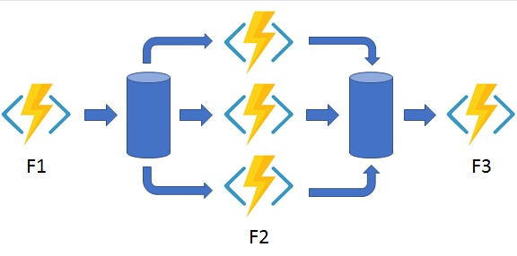
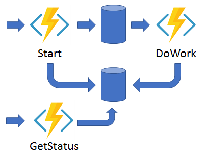
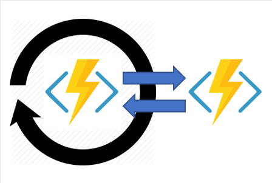

# Azure Functions
 
## Implementation
- implemented using the **Function App**
- very similar to how App Service is deployed
- can use deployment slots
- supports multiple trigger types (TimerTrigger, HttpTrigger, BlobTrigger, CosmosDBTrigger, QueueTrigger, EventGridTrigger etc...)
- multiple triggers ca be defined in the same class
- supports creation and modification of functions, directly in the Azure portal (probably just for interpreted languages)
- when creating a blob triggered function, we need to specify the storage name and the blob container to watch (that belongs to that storage and that holds the blobs)
- similarly, when creating a queue triggered function, we need to specify the storage name and the queue to watch

## Bindings
- input and output bindings are permitted -> see BindingExamples.java
- in the BindingExamples.java I needed to install an [**Azure CosmosDB Emulator**](https://docs.microsoft.com/en-us/azure/cosmos-db/local-emulator?tabs=ssl-netstd21), 
  so that I can provide a "CosmosDBConnection" in the local.settings.json file
- also, because a storage account is required for any Function (by default, when creating a Function in Azure, a storage account is created), the same rule
  applies for local development 
- in order to emulate a storage account on the local machine I needed to install the Azurite plugin in VSCode
- Azurite comes with 3 services that act as storage emulators -> Blob service, Queue service and Table service, For the BindingExamples I needed to start 
  the Blob service (mandatory) and the Queue service (generally optional, but required for the current example, as I am using a Queue output binding)
- Azurite also creates several configuration files (__azurite_db_blob__.json, __azurite_db_blob_extent__.json, __azurite_db_queue__.json, __azurite_db_queue_extent__.json)
  and corresponding directories, where the storage account data is stored (__blobstorage__, __queuestorage__)

## Durable functions
- Great way to create serverless workflows
- Of course, a work flow can also include sub-orchestration
- When creating a durable functions (aka durable tasks) flow, there are at least 3 functions that are created:
  - **Client ("Starter") function** -> initiate a new orchestration (using a trigger)
  - **Orchestrator function** -> defines the steps in the workflow (does not actually execute). Can also handle errors
  - **Activity function** -> can have multiple activity functions, each implementing a step in the workflow
- for now, only C# and Javascript are supported for creating durable functions
- an api is provided out-of-the-box, to check the status of the orchestration

## Orchestration patterns
### Function chaining

### Fan-out Fan-in -> parallel execution, then possible combine the results

### Async HTTP APIs

### Monitor

### Human interaction
